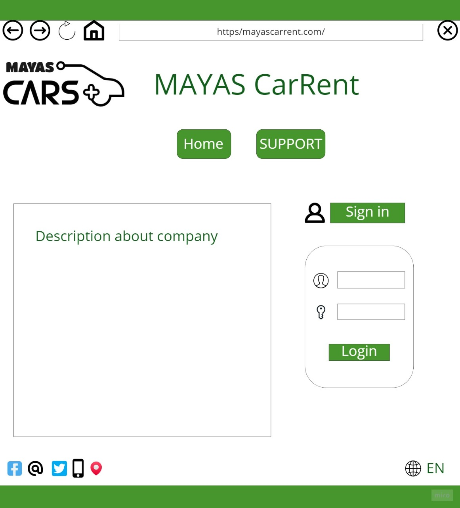
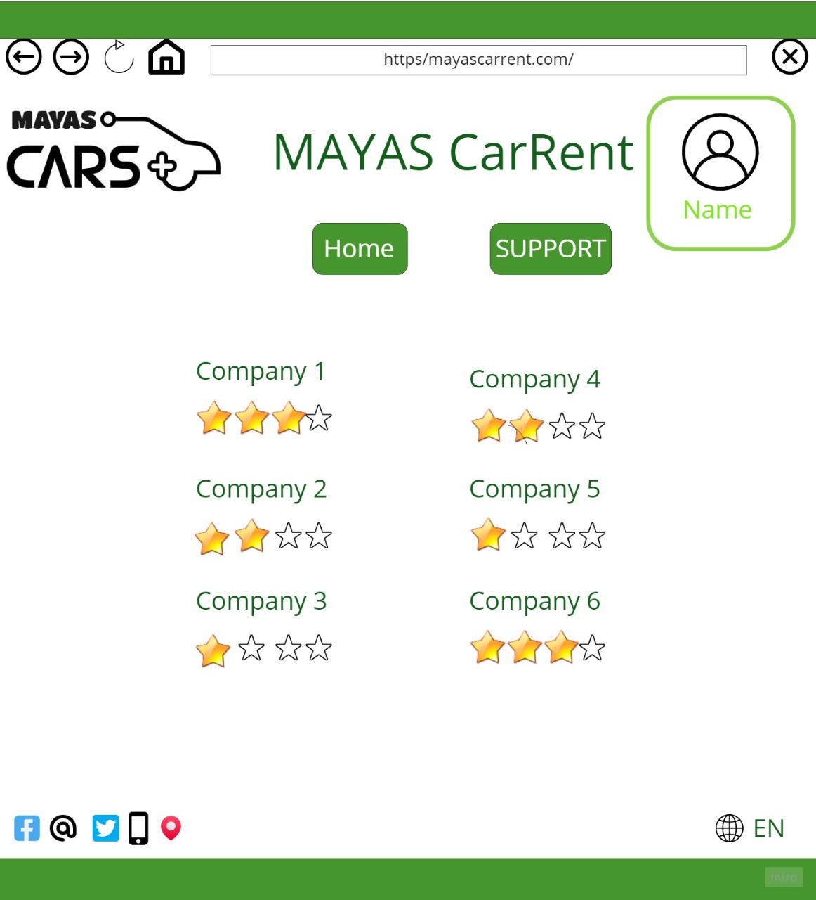
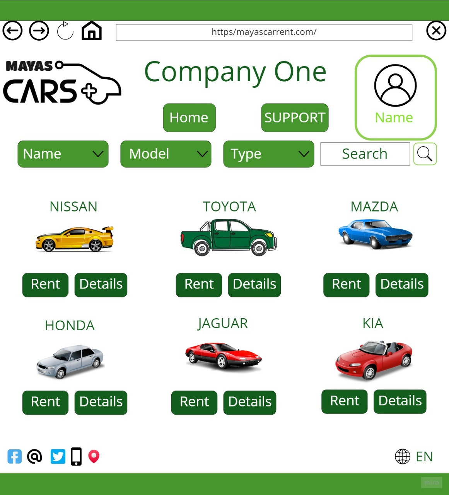
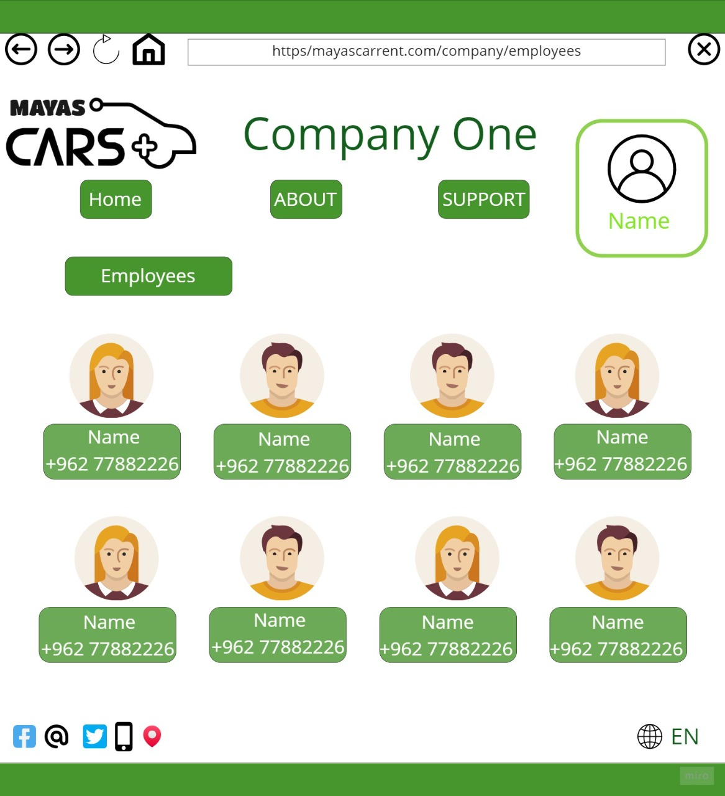
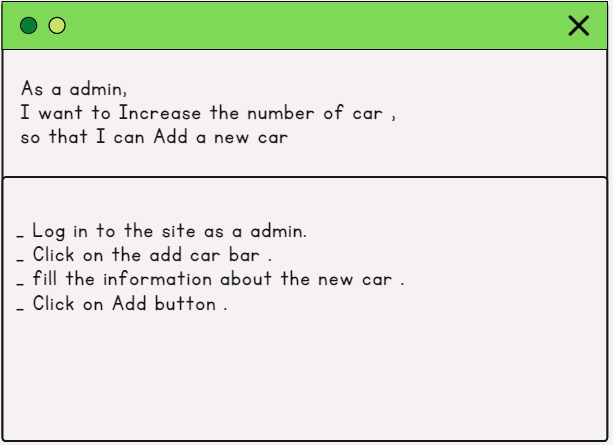
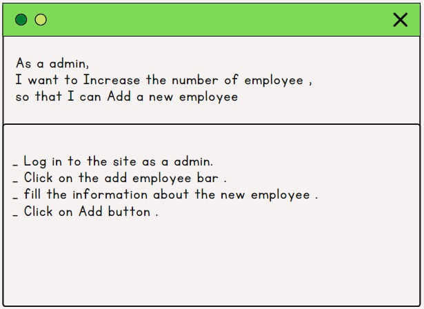
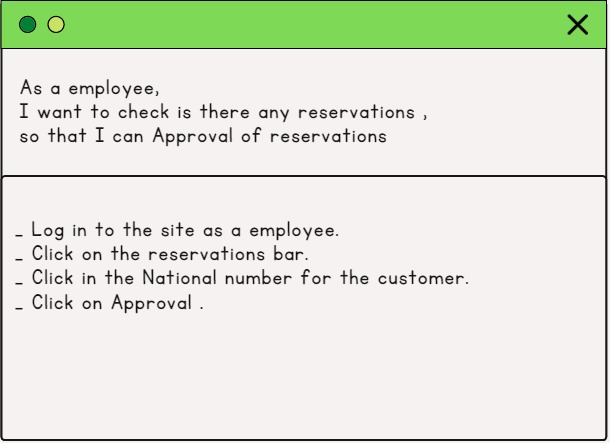
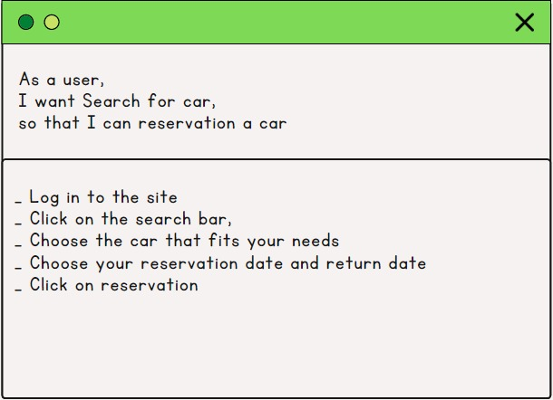
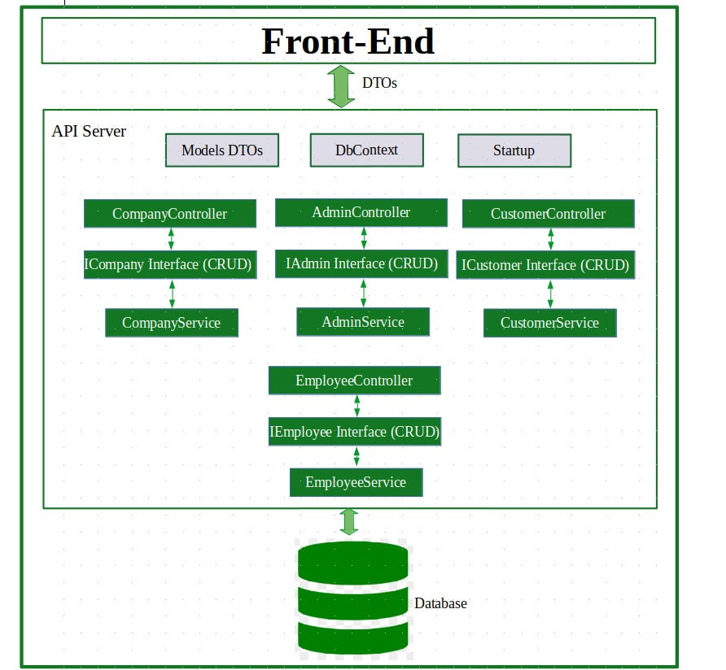
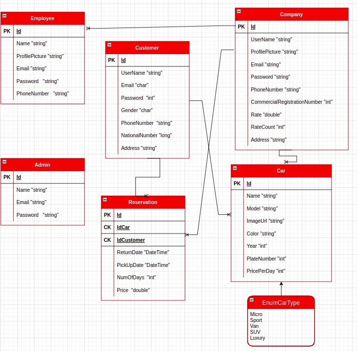

# MAYAS-Car-Rent

## Team 

1. Mutaz Altbakhi
2. Sultan Kanaan 
3. Ola Al-Shlool 
4. Haneen Al-Hamdan
5. AbdUlrahman Jaran 

# Introduction
In this project, We simulated the back-end of a Car Rental system using ASP.Net Core. Our aim was to comply with SOLID coding principles while performing this simulation.

---

## Wireframes

---

## User Stories

---

## Domain Modeling

---

## Database Schema Diagram

---

## Cooperation Plan
Everyone in our team is collaborative and ready to self-learning.
We'll hold a daily meeting to discuss our progress and next steps.

---

## Conflict Plan
If a team member is late or unable to complete a task, we will divide it into portions and assign it to a different team member.
If a disagreement arises, we shall vote to resolve it.

---

## Communication Plan
We'll have a Zoom meeting at 5 p.m. for around 4 hours, and we have a Slack channel where we'll speak with each other beyond work hours and on weekends.

---

## Work Plan
Each needed work should be divided into subtasks and assigned to each team member based on his or her key strengths.

Our tool is Github it's useful for any stakeholder in the development of the project and not just the project managers. They are dynamic tools that can be completely altered to facilitate the needs of teams with different sizes and goals.

---

## Git Process
We have a table of tasks with deadline and status for each one.

| Tasks | Deadline | Status | 
|:-|:-|:-| 
| Planning | 9/5/2022 | Complete |
| Diagram | 10/5/2022 | Uncomplete | 
| Entity FrameWork | 10/5/2022 | Uncomplete | 
| Services | 11/5/2022 | Uncomplete | 
| Controllers | 12/5/2022 | Uncomplete | 
| Identity | 15/5/2022 | Uncomplete | 
| Swagger | 15/5/2022 | Uncomplete | 

